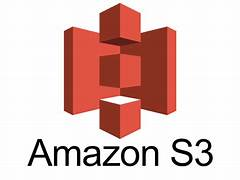

# Hosting a Static Website on Amazon S3

This guide walks you through hosting a static website on Amazon S3, including an `index.html`, two `.png` images.

---

## ✅ Prerequisites
- An AWS account
- AWS CLI or access to the AWS Management Console

---

## 🪣 Step 1: Create an S3 Bucket
- Go to **Amazon S3 Console** → **Create bucket**
- Name your bucket (e.g., `my-static-site-example`)
- **Disable** "Block all public access"
- Keep other defaults and click **Create bucket**

---

## ⚙️ Step 2: Enable Static Website Hosting
1. Open the bucket → Go to **Properties**
2. Scroll to **Static website hosting**
3. Choose **Enable**
4. Index document: `index.html`
5. Error document (optional): `error.html`
6. Save changes

---

## 🌐 Step 3: Add Bucket Policy for Public Read Access

Replace `Bucket-Name` in the policy with your actual bucket name:

```
{
    "Version": "2025-05-14",
    "Statement": [
        {
            "Sid": "PublicReadGetObject",
            "Effect": "Allow",
            "Principal": "*",
            "Action": [
                "s3:GetObject"
            ],
            "Resource": [
                "arn:aws:s3:::my-static-site-example/*"
            ]
        }
    ]
}
```

- Go to **Permissions** tab → **Bucket Policy** → Paste the above JSON → Save

---

## 📂 Step 4: Prepare Your Files

### `index.html`
```
<!DOCTYPE html>
<html lang="en">
<head>
  <meta charset="UTF-8">
  <title>My Static Site</title>
</head>
<body>
  <h1>Welcome to My Static Site</h1>
  
  
</body>
</html>
```

- Add two images: `image1.png`, `image2.png`

---

## ☁️ Step 5: Upload Files to the Bucket

1. Go to **Objects** tab in the bucket
2. Click **Upload** → Add all 4 files: `index.html`, `README.md`, `image1.png`, `image2.png`
3. Set permissions to **Grant public read access**
4. Click **Upload**

---

## 🔗 Step 6: Access Your Static Website

1. Go to **Properties** → **Static website hosting**
2. Copy the **Endpoint URL**
3. Paste it in your browser – you should see your site with images and a link to download `README.md`

---

## 🧹 Step 7: (Optional) Delete the Bucket
- Empty the bucket first (delete all files)
- Then delete the bucket

---

## 💡 Notes
- Hosting is free under AWS Free Tier (5GB storage, 15GB transfer/month)
- Custom error pages can be configured
